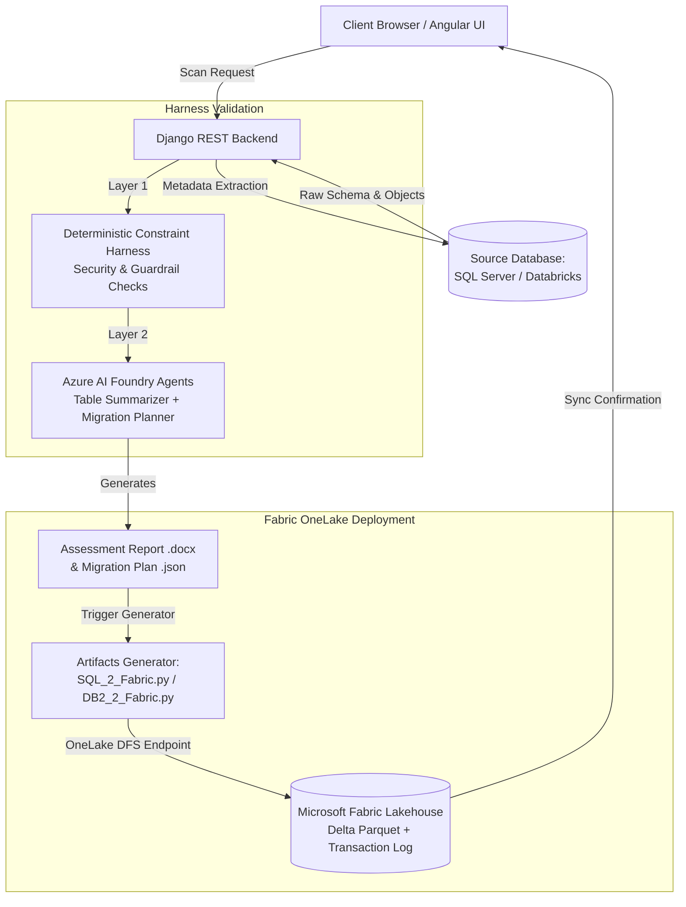

# Azure Powered AI Innovation Hub
> **Ideate • Build • Accelerate**

An enterprise-grade, agentic AI platform designed to automate and accelerate end-to-end database migrations, assessment generation, constraint validation, and Microsoft Fabric OneLake Lakehouse artifact deployment.

---

## 🌟 Overview

The **Azure Powered AI Innovation Hub** accelerates legacy enterprise database migrations into modern cloud data platforms like **Microsoft Fabric OneLake**. By coupling schema metadata extraction with **dual-layer constraint harnesses** and **Microsoft Azure AI Foundry Multi-Agent Orchestration**, it generates comprehensive **Assessment Reports (.docx)**, structured **Migration Plans (.json)**, and directly provisions **Delta Lake tables** in OneLake Lakehouses.

---

## 🚀 Key Modules

### 1. 🗄️ AI Database Migration Studio (`/db-scanner`)
- **Multi-Source Metadata Extraction**: High-speed schema, table, view, column, and constraint scanning for enterprise database engines.
- **Harness Layer 1 (Deterministic Guardrails)**: Enforces security policies, blocks destructive DDL/DML, and audits sensitive data keywords.
- **Harness Layer 2 (Azure AI Foundry Multi-Agent Orchestration)**:
  - **Table Summarizer Generator Agent**: Generates semantic table descriptions and migration recommendations.
  - **Migration Plan Generator Agent**: Synthesizes cross-table dependency graphs and data type mappings.
- **Generated Artifacts & Fabric OneLake Lakehouse Sync**:
  - Direct pipeline execution (`SQL_2_Fabric.py` for SQL Server, `DB2_2_Fabric.py` for Databricks).
  - Delta Lake table creation via OneLake DFS REST endpoints and Azure AD token authentication.
  - Interactive modal with direct deep-links to **Fabric Insights Workspace** and **Fabric Lakehouses**.

### 2. 📊 BI & Dashboard Migrator (`/bi-migrator`)
- Automated discovery and translation of legacy Business Intelligence reports, semantic models, measures, and dashboard dependencies into Power BI / Fabric models.

### 3. 💊 Clinical AI / Medication Reconciliation (`/medication`)
- Domain-specific AI assistant module showcasing agentic extraction, entity recognition, and reconciliation workflows.

---

## 🛠️ Technology Stack

### Frontend
- **Framework**: [Angular 22](https://angular.dev/) (Standalone Components, esbuild/Vite build pipeline)
- **Language**: TypeScript 6.0+
- **Styling**: Bootstrap 5.3.8, Bootstrap Icons, Custom Dark Modern Glassmorphism CSS Design System
- **Reactive Engine**: RxJS 7.8 (Real-time polling, event streaming, and dynamic progress loops)

### Backend
- **Framework**: Python 3.12, Django 5.x, Django REST Framework (DRF)
- **Database Connectors**: `pyodbc`, `pymssql`, `databricks-sql-connector`, `snowflake-connector-python`
- **Data & Storage**: `pyarrow`, `deltalake`, `azure-storage-blob`, `pandas`
- **AI & Agent Orchestration**: `azure-ai-projects`, `azure-identity`, `openai`
- **Document Generation**: `python-docx`
- **Web Server**: Gunicorn, WhiteNoise, Microsoft ODBC Driver 18

---

## 🏗️ Architecture Flow



---

## 📂 Project Structure

```text
├── BackEnd/
│   ├── AI_Agent_Pipeline/          # Azure AI Foundry agent orchestration & prompts
│   │   ├── src/                    # Table Summarizer & Migration Plan Generator agents
│   │   ├── output/                 # Generated docx reports and JSON migration plans
│   │   └── Agents_PipeLine.py      # Multi-agent pipeline entrypoint
│   ├── Artifacts_Generator/        # Fabric deployment scripts
│   │   ├── SQL_2_Fabric.py         # SQL Server -> Fabric OneLake Delta Lake sync
│   │   ├── DB2_2_Fabric.py         # Databricks -> Fabric OneLake Lakehouse sync
│   │   └── plan_to_json.py         # Assessment report to JSON converter
│   ├── config/                     # Django project settings, routes, and WSGI/ASGI
│   ├── Metadata_Scanner/           # Database schema & metadata extraction engines
│   │   └── extractors/             # SQL Server, Databricks, Snowflake, Synapse clients
│   └── Migrator/                   # Django REST views, API endpoints, and job runners
│       └── views.py                # Connect, Scan, Harness, and Artifact generation handlers
│
├── FrontEnd/
│   ├── src/
│   │   ├── app/
│   │   │   ├── components/         # Shared Header, Footer, and Modals
│   │   │   ├── pages/              # db-scanner, home, bi-migrator, medication
│   │   │   └── services/           # Scanner API, Auth, and HTTP helpers
│   │   ├── styles.css              # Global CSS & Dark Mode theme variables
│   │   └── index.html              # HTML5 single page entry point
│   ├── angular.json                # Angular CLI configuration
│   └── package.json                # Frontend dependencies
│
├── Dockerfile                      # Multi-stage production container build
├── requirements.txt                # Python backend dependencies
└── README.md                       # Project documentation
```

---

## ⚙️ Installation & Setup

### Prerequisites
- **Node.js**: `v20.x` or `v22.x` and `npm`
- **Python**: `3.11` or `3.12`
- **ODBC Driver**: Microsoft ODBC Driver 18 for SQL Server (for local SQL Server scans)
- **Azure Subscription / Fabric**: Service Principal credentials with Fabric OneLake permissions

---

### 1. Backend Setup

```bash
# Navigate to the backend directory
cd BackEnd

# Create and activate a Python virtual environment
python -m venv venv
# Windows:
.\venv\Scripts\activate
# macOS/Linux:
source venv/bin/activate

# Install dependencies
pip install -r ../requirements.txt

# Run migrations
python manage.py migrate

# Start the Django development server
python manage.py runserver 8000
```

---

### 2. Frontend Setup

```bash
# Navigate to the frontend directory
cd FrontEnd

# Install Angular dependencies
npm install

# Start the local development server
npm start
# App will be accessible at http://localhost:4200
```

---

### 3. Production Build (Docker)

```bash
# Build the unified container
docker build -t ai-innovation-hub .

# Run container
docker run -p 8000:8000 --env-file .env ai-innovation-hub
```

---

## 🔐 Environment Variables

Create a `.env` file in the root or `BackEnd/` directory:

```env
# Django Settings
DJANGO_SECRET_KEY=your-secure-secret-key
DEBUG=False
ALLOWED_HOSTS=*

# Azure AI Foundry & Agent Models
AZURE_AI_FOUNDRY_PROJECT_ENDPOINT="https://<your-foundry-resource>.services.ai.azure.com/api/projects/<project-name>"
AZURE_AI_FOUNDRY_AGENT_NAME="MyAgent"
# Distinct deployed models for the two agents (strictly enforced):
AZURE_AI_FOUNDRY_TABLE_SUMMARIZER_MODEL="gpt-4.1-mini"       # Model for Table Summarizer Agent
AZURE_AI_FOUNDRY_MIGRATION_PLAN_MODEL="gpt-4o"              # Model for Migration Plan Generator Agent
# Legacy single model fallback:
AZURE_AI_FOUNDRY_MODEL_DEPLOYMENT_NAME="gpt-4.1-mini"

# Azure Service Principal / Fabric Identity
AZURE_TENANT_ID="<your-tenant-id>"
AZURE_CLIENT_ID="<your-client-id>"
AZURE_CLIENT_SECRET="<your-client-secret>"

# Microsoft Fabric Lakehouse & Workspace Target
FABRIC_WORKSPACE_ID="bae3b540-d044-45e0-8c52-3cf4ee3dcb31"
FABRIC_LAKEHOUSE_ID="87ddccfe-cfa3-47d6-92ab-b638ce379319"
```

---

## 🛡️ License & Acknowledgments

- **Organization**: Apexon AI Innovation Hub
- **Platform**: Microsoft Azure & Microsoft Fabric
